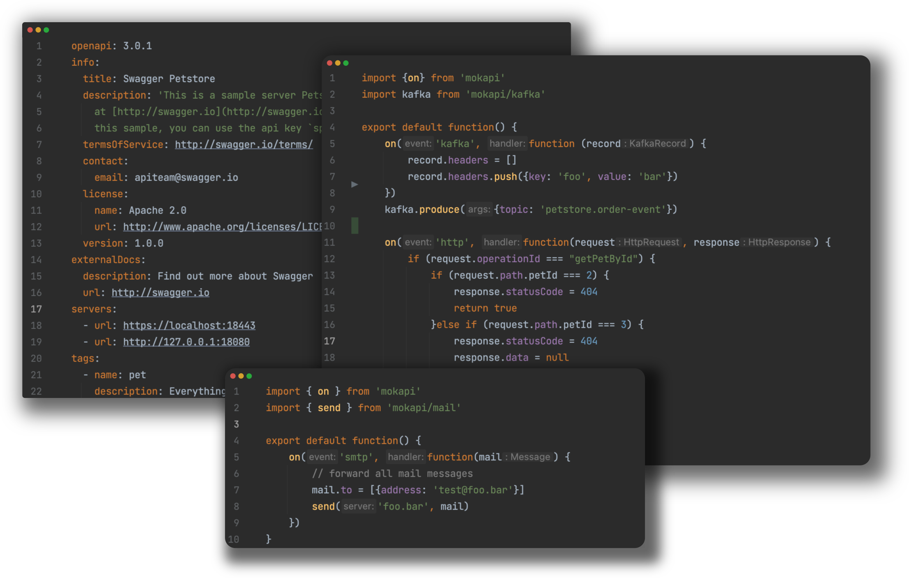
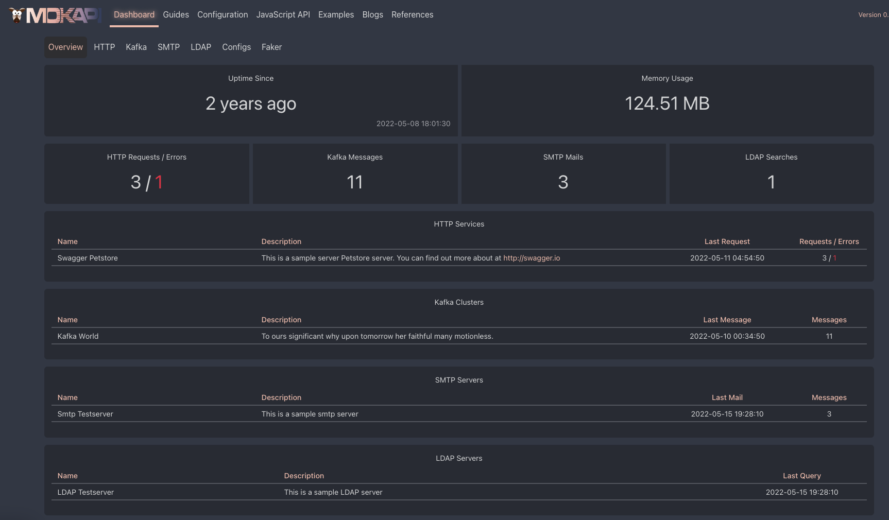

<p align="center">
<a href="https://mokapi.io">

</a>
</p>

<h3 align="center">Easy and flexible API mocking</h3>

<p align="center">
<a href="https://github.com/marle3003/mokapi/releases"></a>
<a href="https://github.com/marle3003/mokapi/actions/workflows/build.yml"></a>
<a href="https://codecov.io/gh/marle3003/mokapi"></a>
<a href="https://github.com/marle3003/mokapi/blob/master/LICENSE"></a>
</p>
<p align="center">
    <a href="https://github.com/marle3003/mokapi/releases">Download</a> ·
    <a href="https://mokapi.io/docs/guides/get-started/welcome">Documentation</a>
</p>

**Mokapi** is an open-source tool that allows developers to create
and test API designs before actually building them.

With Mokapi you can quickly and easily test various
scenarios, such as delayed or failed responses without
having to rely on a fully functional API.

Mokapi helps you improve the quality of APIs and
reduces the risk of bugs or errors in production.

Its core feature are:

- **Multiple Protocol support**: HTTP, HTTPS, Apache Kafka, SMTP, LDAP
- **Everything as Code**: Reusing, version control, consistency and integrate tests with your CI.
- **An embedded JavaScript engine** to control everything - status, headers, delays, errors or other edge cases.
- **Patch Configuration**
- **Multiple Provider support**: File, HTTP, GIT to gather configurations and scripts.
- **Dashboard** to see what's going on.

## Example



## Web UI



## Usage

```shell
docker run --env 'MOKAPI_Services_Swagger-Petstore_Config_Url'='https://raw.githubusercontent.com/OAI/OpenAPI-Specification/main/examples/v3.0/petstore.yaml' \
  --env 'MOKAPI_Services_Swagger-Petstore_Http_Servers[0]_Url'='http://:80' \
  -p 80:80 -p 8080:8080 \
  mokapi/mokapi:latest
```

## Documentation

- [Get Started](https://mokapi.io/docs/guides/get-started/welcome)
- [HTTP](https://mokapi.io/docs/guides/http/overview)
- [Kafka](https://mokapi.io/docs/guides/kafka/overview)
- [LDAP](https://mokapi.io/docs/guides/ldap/overview)
- [SMTP](https://mokapi.io/docs/guides/smtp/overview)
- [Javascript API](https://mokapi.io/docs/javascript-api)
- [Examples](https://mokapi.io/docs/examples)