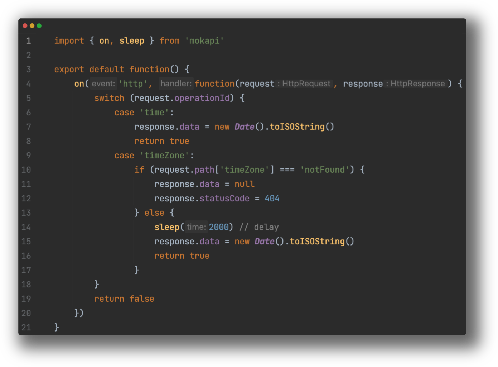

<p align="center">
<a href="https://mokapi.io">

</a>
</p>

<h3 align="center">Easy and flexible API mocking</h3>

<p align="center">
<a href="https://github.com/marle3003/mokapi/releases"></a>
<a href="https://github.com/marle3003/mokapi/actions/workflows/test.yml"></a>
<a href="https://codecov.io/gh/marle3003/mokapi"></a>
<a href="https://github.com/marle3003/mokapi/blob/master/LICENSE"></a>
</p>
<p align="center">
    <a href="https://github.com/marle3003/mokapi/releases">Download</a> ·
    <a href="https://mokapi.io/docs/guides/get-started/welcome">Documentation</a>
</p>

**Mokapi** is an open-source tool that allows Agile, DevOps and Continuous Deployment teams
to create and test API designs before actually building them.

With Mokapi you can quickly and easily test various
scenarios, such as delayed or failed responses without
having to rely on a fully functional API.

Mokapi helps you improve the quality of APIs and
reduces the risk of bugs or errors in production.

Its core feature are:

- **Multiple Protocol support**: HTTP, HTTPS, Apache Kafka, SMTP, LDAP
- **Everything as Code**: Reusing, version control, consistency and integrate mocks with your CI/CD.
- **An embedded JavaScript engine** to control everything - status, headers, delays, errors or other edge cases.
- **Patch Configuration** changes for mocking needs, rather than changing the original contract
- **Multiple Provider support**: File, HTTP, GIT, NPM to gather configurations and scripts.
- **Dashboard** to see what's going on.

## Usage

Windows
```shell
choco install mokapi
mokapi --providers-http-url https://petstore31.swagger.io/api/v31/openapi.json
```

MacOS
```shell
brew tap marle3003/tap 
brew install mokapi
mokapi --providers-http-url https://petstore31.swagger.io/api/v31/openapi.json
```

Docker
```shell
docker run --env 'MOKAPI_Providers_Http_URL'='https://petstore31.swagger.io/api/v31/openapi.json' -p 80:80 -p 8080:8080 mokapi/mokapi:latest
```

Run a request
```shell
curl http://localhost/api/v31/pet/2 -H 'Accept: application/json'
```

## Example



## Dashboard


## Documentation

- [Get Started](https://mokapi.io/docs/guides/get-started/welcome)
- [HTTP](https://mokapi.io/docs/guides/http)
- [Kafka](https://mokapi.io/docs/guides/kafka/overview)
- [LDAP](https://mokapi.io/docs/guides/ldap/overview)
- [SMTP](https://mokapi.io/docs/guides/smtp/overview)
- [Javascript API](https://mokapi.io/docs/javascript-api)
- [Examples & Tutorials](https://mokapi.io/docs/examples)
- [Blogs](https://mokapi.io/docs/blogs)

&nbsp;
<p align="center">
<a href="https://www.buymeacoffee.com/mokapi" target="_blank"></a>
<p align="center">