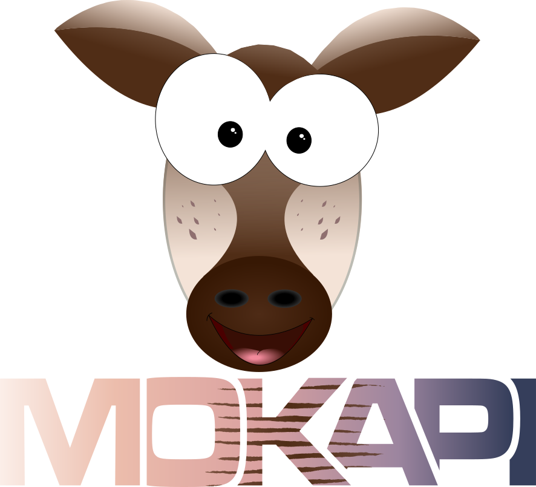

<p align="center">
<a href="https://mokapi.io">

</a>
</p>

<h3 align="center">Your API Mocking Tool for Agile Development</h3>

<p align="center">
<a href="https://github.com/marle3003/mokapi/releases"></a>
<a href="https://github.com/marle3003/mokapi/actions/workflows/test.yml"></a>
<a href="https://codecov.io/gh/marle3003/mokapi"></a>
<a href="https://github.com/marle3003/mokapi/blob/master/LICENSE"></a>
</p>
<p align="center">
    <a href="https://github.com/marle3003/mokapi/releases">Download</a> ·
    <a href="https://mokapi.io/docs/guides/welcome">Documentation</a>
</p>

# 🚀 Overview

Mokapi is an open-source tool that helps Agile, DevOps, and Continuous 
Deployment teams design, test, and validate APIs before implementation. 
It enables rapid prototyping of scenarios—like delayed responses, 
failures, or edge cases—without needing a live backend. By simulating 
real-world conditions early, Mokapi improves API quality and reduces 
the risk of bugs in production.

# ✨ Features

- **Multiple Protocol support**: HTTP, HTTPS, Apache Kafka, SMTP, LDAP
- **Everything as Code**: Reusing, version control, consistency and integrate mocks with your CI/CD.
- **An embedded JavaScript engine** to control everything - status, headers, delays, errors or other edge cases.
- **Patch Configuration** changes for mocking needs, rather than changing the original contract
- **Multiple Provider support**: File, HTTP, GIT, NPM to gather configurations and scripts.
- **Dashboard** to see what's going on.

## 🔧 Spin Up Mokapi

Install and start Mokapi using one of the following methods.
Replace the URL with your own OpenAPI or AsyncAPI specification.

Windows
```shell
choco install mokapi
mokapi https://petstore31.swagger.io/api/v31/openapi.json
```

MacOS
```shell
brew tap marle3003/tap 
brew install mokapi
mokapi https://petstore31.swagger.io/api/v31/openapi.json
```

Docker
```shell
docker run -p 80:80 -p 8080:8080 mokapi/mokapi:latest https://petstore31.swagger.io/api/v31/openapi.json
```

# 🎯 Hit Your First Mock
Once Mokapi is running, you can make requests to your mocked API like so:
```shell
curl http://localhost/api/v31/pet/2 -H 'Accept: application/json'
```

# 🧩 Customize Your Mock with JavaScript

Mokapi makes it simple to control responses using embedded JavaScript.

For example, you can dynamically change the response based on query parameters:

```typescript
import { on } from 'mokapi';

export default function() {
    on('http', (request, response): boolean => {
        switch (request.path.petId) {
            case 2:
                response.data.name = 'Betty';
                return true;
            case 9:
                response.statusCode = 404;
        }
        return false;
    });
}
```

# 🖥️ Dashboard

Mokapi’s dashboard lets you visualize your mock APIs. View requests and responses in real-time, generate and validate sample data for testing.


# 🧪 Learn by Example

Explore tutorials that walk you through mocking different protocols and scenarios:

- 🌍 [Get started with REST API](https://mokapi.io/docs/resources/tutorials/get-started-with-rest-api)\
  This tutorial will show you how to mock a REST API using an OpenAPI specification.

- ⚡ [Mocking Kafka with AsyncAPI](https://mokapi.io/docs/resources/tutorials/get-started-with-kafka)\
  Mocking a Kafka topic using Mokapi and verifying that a producer generates valid messages.

- 👨‍💻 [Mocking LDAP Authentication](https://mokapi.io/docs/resources/tutorials/mock-ldap-authentication-in-node)\
  Simulate LDAP-based login flows, including group-based permissions.

- 📧 [Mocking SMTP Mail Servers](https://mokapi.io/docs/resources/tutorials/mock-smtp-server-send-mail-using-node)\
  Use Mokapi to simulate sending and receiving emails in Node.js apps.

- 🖥️ [End-to-End Testing with Jest and GitHub Actions](https://mokapi.io/docs/resources/tutorials/running-mokapi-in-a-ci-cd-pipeline)\
  Integrate Mokapi into your CI pipeline for full-stack E2E testing.

> More examples are available on [mokapi.io/docs/resources](https://mokapi.io/docs/resources)

# 📚 Documentation

- [Get Started](https://mokapi.io/docs/guides/welcome)
- [HTTP](https://mokapi.io/docs/guides/http)
- [Kafka](https://mokapi.io/docs/guides/kafka/overview)
- [LDAP](https://mokapi.io/docs/guides/ldap/overview)
- [SMTP](https://mokapi.io/docs/guides/smtp/overview)
- [Javascript API](https://mokapi.io/docs/javascript-api)
- [Resources](https://mokapi.io/docs/resources)

# ☕ Support

If you find Mokapi helpful, consider supporting the project:

<a href="https://www.buymeacoffee.com/mokapi" target="_blank"></a>

# 📄 License

This project is licensed under the MIT License. See the [LICENSE](https://github.com/marle3003/mokapi/blob/main/LICENSE) file for details.